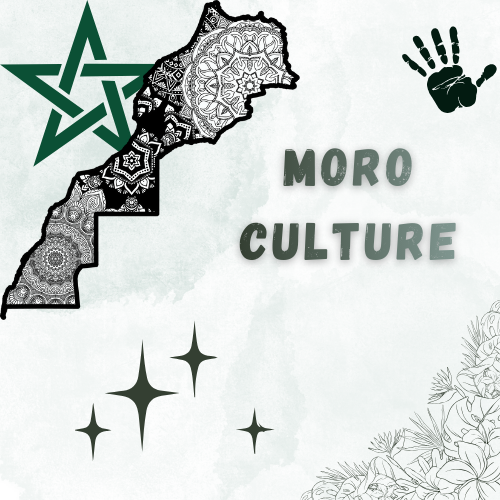

  

<h1 align="center">🇲🇦 MoroCulture</h1>

A responsive static website built with HTML, CSS, and Bootstrap to highlight Moroccan culture and heritage.

---

## 🌍 Live Demo

👉 https://grand-puffpuff-d86800.netlify.app/

---

## 🧠 Overview

MoroCulture is a modern and responsive static website that showcases Moroccan culture, traditions, and identity through a clean and structured design.

The goal of this project is to combine aesthetic design with simplicity while practicing front-end development skills.

---

## 🛠️ Built With

- HTML5  
- CSS3  
- Bootstrap 5  

---

## ✨ Features

- Fully responsive design (mobile, tablet, desktop)
- Modern UI using Bootstrap components
- Clean layout and smooth sections
- Cultural presentation of Moroccan heritage
- Fast and lightweight static website

---

